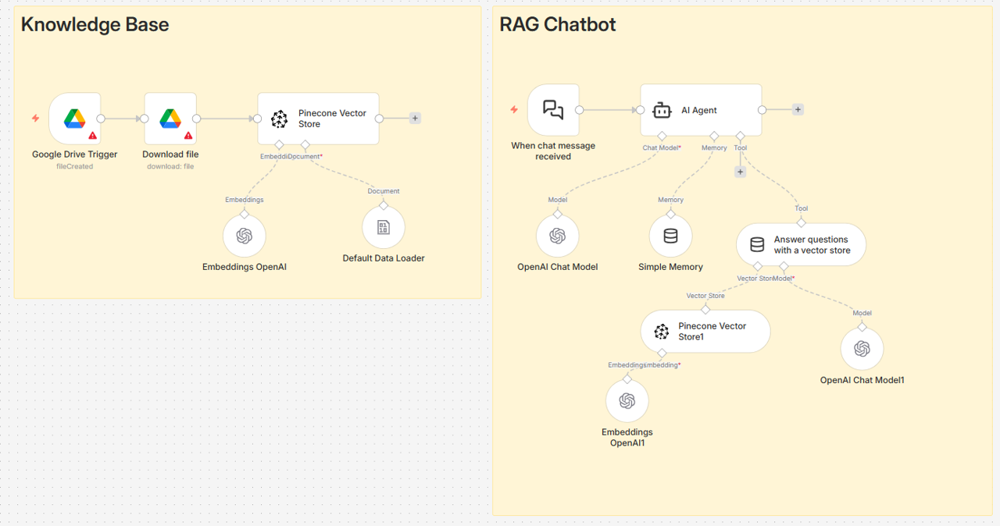

# agentic-rag-financial-pipeline
Agentic RAG pipeline using n8n, Pinecone, and OpenAI for automated financial report analysis and question answering.

# 🤖 RAG Chatbot for Financial Reports (n8n + Pinecone + OpenAI)

An automated Retrieval-Augmented Generation (RAG) chatbot built using **n8n**, **Pinecone**, and **OpenAI**, designed to analyze and answer questions about Apple’s quarterly financial reports.

---

## 🚀 Overview

This project implements a fully automated pipeline that:

1. Monitors a Google Drive folder for new files
2. Downloads financial reports automatically
3. Converts them into embeddings using OpenAI
4. Stores them in Pinecone vector database
5. Uses an AI Agent to answer user questions based on retrieved context

The system ensures **accurate, concise, and data-grounded responses** using real financial data.

---

## 🧠 Architecture

### 🔹 Knowledge Base Pipeline
- Google Drive Trigger → detects new files
- File Downloader → downloads reports
- Data Loader → processes documents
- OpenAI Embeddings → converts text into vectors
- Pinecone Vector Store → stores embeddings

### 🔹 Chatbot Pipeline
- Chat Trigger → receives user queries
- AI Agent → processes question
- Vector Store Tool → retrieves relevant context
- OpenAI Model → generates final answer
- Memory Buffer → keeps conversation context

---

## ⚙️ Technologies Used

- **n8n** – workflow automation
- **OpenAI API** – embeddings & chat model (GPT-4.1-mini)
- **Pinecone** – vector database
- **Google Drive API** – file ingestion
- **LangChain Nodes (n8n)** – RAG components

---

## 📂 Workflow Features

✔ Automated data ingestion  
✔ Real-time knowledge base updates  
✔ Context-aware question answering  
✔ Memory-enabled conversations  
✔ Scalable vector search  

---

## 🧩 Use Case

The chatbot is specialized for:

📊 Apple quarterly financial reports  
- Revenue & profit analysis  
- Margins and growth  
- Financial insights  
- Q1 / Q2 comparisons  

